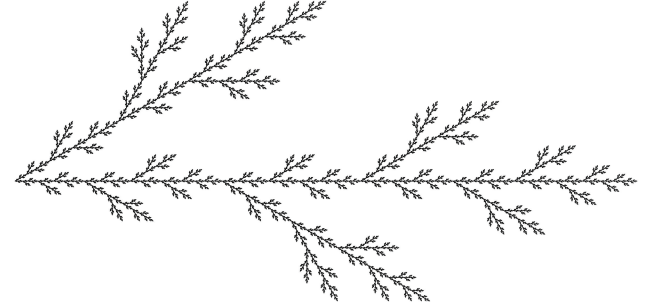

#### Undergraduate

I was born in Los Angeles, CA but raised in the central coast. While attending University of California, Santa Barbara, I didn't know what I wanted to study so I ended up studying physics. However, while there I found that I enjoyed the mathematical abstraction of everything more. As a result, I also managed to nab a degree in mathematics.

#### Graduate

Since I enjoyed the abstraction more, I decided to pursue my PhD in mathematics. My interested tending to gravitate towards mathematical analysis. I ended up studying analytical properties of fractal under Michel Lapidus. My thesis was on a mix of fractal geometry, differential equations, and noncommutative geometry. I took a wide variety of coursework, focusing on a wide variety of topics from algebraic geometry and category theory to mathematical physics.

Many questions related to calculus (derivatives and integrals) are easily answered in an n-dimension manifolds. However, on fractals there is a much more complicated notion of "a step in this direction," since the number of paths one can take is in theory infinite. Specifically, much of my research was focused on the Hata tree.

#### Postgraduation

As I was finishing up my PhD, I realized I loved the mathematical abstraction of everything, but preferred to have equations correspond to something physical. From there, I decided to teach myself to code while finishing up my PhD and fell in love with the world of machine learning. Followed this up with a fellowship at the Data Incubator, a program designed to transition academics into doing machine learning and data science work. Since then, I've worked with a wide variety of problems involving a wide variety of tools. These include everything from both classical and deep machine learning with applications in finance, computer vision, natural language processing, and supply chain analysis. I currently live in the San Francisco Bay Area.