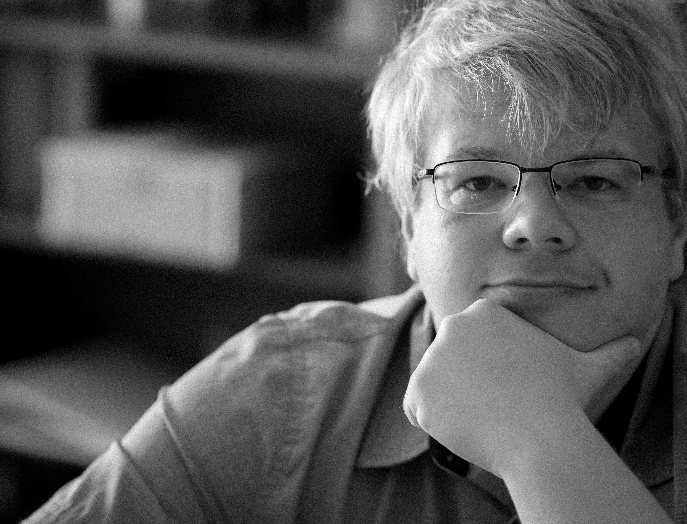

I'm currently a machine learning researcher currently located in the Silicon Valley, California. Prior to this, I have my PhD in mathematics at the University of California, Riverside. Specifically, I was under the supervision of [Dr. Michel Lapidus](http://math.ucr.edu/~lapidus/) in the [fractal research group](http://www.math.ucr.edu/~frgmpds/). My thesis was on a mix of fractal geometry, differential equations, and noncommutative geometry. Prior, I studied mathematics and physics at the University of California, Santa Barbara.

I am also a data science fellow at [The Data Incubator](https://www.thedataincubator.com).

My resume is available [here](/assets/Resume.pdf). I also typically hang around the [Kaggle community](https://www.kaggle.com), where you can find [my profile](https://www.kaggle.com/frankkloster).

When I'm not working, I like to read, hike, and take pictures.